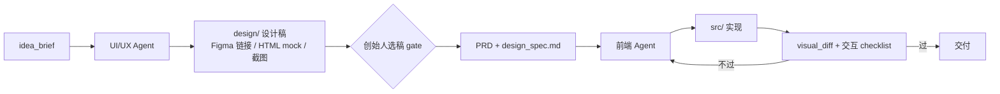

# CorpPilot 企业智脑 · 问题梳理、迭代过程与后续规划

> 文档版本：v2.3  
> 更新日期：2026-06-01  
> 项目地址：[xiaoyangtx996/CorpPilot](https://github.com/xiaoyangtx996/CorpPilot)

**实现状态图例：** ✅ 已完成 · 🟡 部分完成 · ⬜ 待做

| 里程碑 | 状态 |
|--------|------|
| M1 治理 ↔ Runtime 接线 | ✅ |
| M2 Skill 进 Runtime | ✅ 部门 Skill 面板 + 在线编辑 |
| M3 Flow Template | ✅ |
| M4 Postcondition + Dev 闭环 | ✅ send_back/retry + task pytest |
| M5 多 Agent 并行 | ✅ artifact 路径规范 |
| M6 Skill 自进化 | ✅ |
| M7 生态与产品化 | ⬜ 长期（n8n / 多项目等） |
| M8 模型网关与财务部 | ✅ 预算/RPM UI + 限流 |
| M9 监督型部门 + UI 落地 | ✅ checklist + send_back 自动化 |

---

## 一、产品愿景（我们要做什么）

CorpPilot 不是「又一个 Claude Code」，而是 **面向创始人 / 一人公司（OPC）的「赛博公司操作系统」**：

- **创始人**提出想法，与「董事会」讨论、丰富边界，在关键节点拍板；
- **多 Agent** 按角色协作（产品、项目、研发、测试…），产出可运行的 coding 结果；
- **抛弃传统冗长的人工公司流程**，但保留 **可选的节点控制**（自动 / 等我确认 / 跳过 / 直接下令）；
- **聚焦开发者场景**：从想法 → Demo/PRD → 代码 → 测试 → 迭代，全链路可治理、可审计、可复用。

一句话定位：

> **Claude Code 是工位上的工人；CorpPilot 是公司制度 + 流程编排 + 多 Agent 调度台 + Skill 资产库。**

---

## 二、当前架构盘点（As-Is）

### 2.1 三层结构

| 层级 | 模块 | 成熟度 | 说明 |
|------|------|--------|------|
| **治理层** | `TaskService`、`WorkflowEngine`、`BoardRoom`、`Dashboard` | ⭐⭐⭐⭐ 较完整 | 任务状态机、干预、董事会、权限矩阵、审计 |
| **执行层** | `scripts/runtime/` + `runtime_bridge.py` | ⭐⭐⭐ 已接线 | LLM 循环 + 工具；**状态变更自动 spawn**；`report_done` 回写产物 |
| **知识层** | `agents/*/SOUL.md`、`skills/`、`SkillCatalogService` | ⭐⭐⭐ 已注入 | SOUL + **Skill 正文进 system prompt**；flow step 可指定 `skills` |
| **工艺层** | `flows/` + `flow_engine.py` | ⭐⭐ 雏形 | greenfield / hotfix 模板；**FlowEngine 驱动 step**；legacy 兼容 |

### 2.2 已有能力（值得保留）

- **四层组织架构**：决策 / 审核 / 执行 / 支撑，13 部门、46 Agent 角色定义；
- **董事会机制**：讨论 → 投票 → 多数通过；董事长 **直接下令**（紧急通道）；
- **任务状态机**：`pending → … → completed`，含 `pause` / `resume` / `send_back`；
- **权限矩阵**：谁可提案、审核、派发、创建/回收动态 Agent；
- **HR 动态扩缩容**：大项目临时增加同类型 Agent（设计已有，执行待深化）；
- **企业看板**：任务、Agent 健康、事件、董事会提案；
- **Runtime 雏形**：`agent_loop`（SOUL + LLM + tools）、`MessageBus`（Agent 互发消息）；
- **模型路由与流量监控**：`ModelRouter`、`TrafficMonitor`（多模型、可观测）。

### 2.3 与 Stratum / Claude Code 的定位关系

| 产品 | 角色 |
|------|------|
| **Claude Code** | 单 Agent 强 coding 执行引擎 |
| **Stratum** | 单条开发流水线的工艺卡（step、postcondition、trace） |
| **CorpPilot** | 多角色、多阶段、创始人可控的 **公司 OS**；dev 步可接 Claude Code 或自研 runtime |

---

## 三、当前核心问题（Problem Statement）

### P1 · 治理与执行「两张皮」（最严重） — ✅ 已缓解（M1）

**现象：**

- `WorkflowEngine` / `ExecutionService` 只管 **JSON 任务状态**（`executing` → `review`）；
- `AgentManager.spawn()` 通过 `/api/run/task` **手动触发**，与任务流转 **无自动绑定**；
- 任务状态变了，不会自动 spawn 对应部门 Agent；Agent 跑完了，也不会自动推进 workflow。

**后果：** 看板像「空转的公司流程」，Agent 像「手动点的聊天机器人」，企业智脑感断裂。

---

### P2 · Coding 执行深度不足 — 🟡 部分缓解

**现象：**

- `ToolExecutor` 当前工具：`send_message`、`read_file`、`write_file`、`create_task`、`report_done`；
- **缺少**：`git`、MCP、依赖安装等；✅ 已增 `run_shell`；🟡 `tests_pass` 经 postcondition 调 pytest；
- 无法稳定产出「可运行、可验证」的 code，与 Claude Code 差距大。

**后果：** 研发 Agent 只能写文件，不能「写代码 → 跑测试 → 修到绿」闭环。

---

### P3 · Skill 未进入 Runtime — ✅ 已解决（M2）

**现象：**

- `SkillCatalogService` 支持增删改 Skill；
- ~~`agent_loop` 只加载 `SOUL.md`~~ → ✅ 已加载绑定 Skill；flow step 可 `skills: [xxx]`；
- SOP（`docs/sop/*.md`）是文档，不是 runtime 校验。

**后果：** 「每个部门有 Skill、可自进化」停留在设计层，执行时仍是裸 SOUL。

---

### P4 · 流程绑死在「13 部门编制」 — 🟡 部分缓解（M3）

**现象：**

- `TASK_STAGE_OWNER` 固定：总裁办 → 战略 → 风控 → PMO → 执行…；
- 所有任务走同一套状态链，无法按场景切换（如 greenfield / hotfix / 纯内容）。

**后果：** 创始人感觉 **自由度差**——小想法也要走「大公司全套审批链」。

---

### P5 · 缺少 Artifact 与 Postcondition

**现象：**

- 阶段之间主要靠 `current_owner` 和聊天记录传递；
- 没有强制的产出物：`idea_brief.md`、`PRD.md`、`demo/`、`test_report.md`；
- SOP 里的规则（如「相似度 > 70%」）无法 programmatic 校验。

**后果：** 「严格对齐 Demo + PRD 出 code」无法机器保证，只能靠 Agent 自觉。

---

### P6 · 工程接入问题 — ✅ 已解决

**现象：**

- ~~`server.py` import 路径~~ → ✅ `sys.path` 注入 `scripts/`，`/api/run/task` 可用；

**后果：** 本地/部署环境不一致，执行层难以稳定演示。

---

### P7 · 多 Agent 协作编排不完整

**现象：**

- `MessageBus` 支持 Agent 互发消息；
- 缺少：**谁何时上场、并行 dev、合并门禁、循环直到 postcondition 过** 的 flow 定义；
- HR 动态 Agent 与并行开发 loop 未在 runtime 落地。

**后果：** 「一群 Claude Code 协作」只有消息，没有流水线。

---

### P8 · 模型配置与财务部未产品化

**现象：**

- `ModelRouter` 已有四级路由，但 Dashboard 模型页与部门编制 **未打通**；
- `TrafficMonitor` 按 agent 统计，缺少 **部门 / 任务 / flow step** 维度；
- 财务部在 README 里是 metaphor，**没有** cost_report、预算告警、结案审计。

**后果：** 各 Agent 用不同模型时，创始人看不到「本项目/本部门花了多少 token、谁最贵」。

---

### P9 · 监督型部门未接入 Flow

**现象：**

- 风控、法务、测试在 SOP 里有描述，但 **不是** flow 里的 `supervisor` step；
- 无 Stratum 式 postcondition 失败 → `send_back` 的自动回路。

**后果：** 「部门监督产出是否达标」仍靠人工，无法机器保证。

---

### P10 · UI 设计稿 → 代码未标准化

**现象：**

- 产品中心可产出 Demo，但缺少 `design/` artifact 规范与 visual_diff 验收 step。

**后果：** 「上面 UI 稿、下面直接落地」没有可执行 pipeline。

---

## 四、问题根因（Root Cause）

```
愿景层：创始人要快、节点可控、多 Agent 产出 code
    ↓
实现层：先做成了「大厂编制 + 任务看板 + 轻量 LLM loop」
    ↓
断层：Flow（流程 spec）与 Executor（coding 引擎）未统一；
      Skill/SOP 未硬化为 postcondition；
      治理状态机未驱动 Agent 生命周期
```

**本质：** CorpPilot 已经做好了 **「公司制度」**，但还没做好 **「项目工艺卡 + 工人调度 + 质检站」** 三者的接线。

---

## 五、迭代过程记录（Evolution Log）

### Phase 0 · 概念与骨架（已完成）

| 里程碑 | 内容 |
|--------|------|
| 组织架构 | 13 部门、SOUL.md、roles、权限矩阵 |
| 治理核心 | TaskService、WorkflowEngine、BoardRoom |
| 可视化 | Dashboard、会议室、部门健康 |
| 文档 | architecture.md、SOP、README |

**成果：** 产品叙事清晰，治理模型可用。  
**遗留：** 执行层薄，flow 不可配置。

---

### Phase 1 · Runtime 雏形（✅ 已完成）

| 里程碑 | 内容 | 状态 |
|--------|------|------|
| agent_loop | SOUL + LLM + function calling 循环 | ✅ |
| AgentManager | 多线程 spawn、状态快照 | ✅ |
| MessageBus | Agent 间消息 | ✅ |
| ModelRouter | 按部门/角色路由模型 | ✅ |
| /api/run/task | 手动触发 Agent | ✅ |
| Skill 注入 | `_load_skills` + `skill_ids` | ✅ |
| run_shell | 命令执行工具 | ✅ |

**成果：** 每部门独立 Agent loop，工具与 Skill 可用。  
**遗留：** Claude Code CLI / MCP 未接。

---

### Phase 2 · 治理驱动执行（✅ 已完成，2026-06-01）

目标：**任务状态变更 → 自动 spawn Agent → 产出 artifact → 校验 → 推进下一步**。

| 交付 | 模块 |
|------|------|
| 状态 hook | `WorkflowEngine._notify_status_enter` |
| 自动调度 | `scripts/runtime_bridge.py` |
| 产物字段 | `task.artifacts[]`、`GET /api/tasks/:id/artifacts` |
| Dashboard | 任务列表展示 flow step + 产出数量；详情抽屉 |

---

### Phase 3 · Flow Template + 节点控制（✅ 已完成）

目标：**flow 与 org 解绑**；每 step 支持 `auto | gate | skip | override`。

| 交付 | 状态 |
|------|------|
| `flows/greenfield.yaml` + `.json` | ✅ |
| `flows/hotfix.yaml` + `.json` | ✅ |
| `FlowEngine` | ✅ `scripts/flow_engine.py` |
| 创建任务选 flow | ✅ API + Dashboard |
| gate approve / skip / override | ✅ API + Dashboard Override 按钮 |
| 董事会 direct_order 绑 skip | ✅ `board_flow.py` + API |
| Flow 市场导入 / 导出 | ✅ `flow_io.py` + Dashboard |
| 任务另存为 Flow | ✅ Dashboard + API |

---

### Phase 4 · 强 Coding 闭环（✅ 已完成）

目标：dev_loop 接 Claude Code CLI 或扩展 tools + postcondition（测试必须通过）。

| 交付 | 状态 |
|------|------|
| `postcondition.py` | ✅ 文件存在 / tests_pass / prd_coverage / checklist |
| flow step 失败 send_back + retry | ✅ `handle_step_failure` + `rewind_to_step` |
| Claude Code CLI | ✅ `execution_backends.py` + demo 脚本 |
| visual_diff | ✅ 文本 + 结构 + 可选截图 |

---

### Phase 5 · 待规划：Skill 自进化

目标：任务成功后蒸馏 Skill 提案 → 创始人 approve → 入库（参考 xskill 思路）。

---

## 六、目标架构（To-Be）

```
┌─────────────────────────────────────────────────────────────┐
│  创始人 / 董事会（CorpPilot Dashboard）                        │
│  · 提案 · 讨论 · 投票 · 直接下令 · 节点 gate 确认              │
└───────────────────────────┬─────────────────────────────────┘
                            │
┌───────────────────────────▼─────────────────────────────────┐
│  Flow Engine（项目工艺卡，可配置 yaml）                         │
│  · flows/greenfield.yaml · hotfix.yaml · content.yaml        │
│  · step: role + skills + tools + postcondition + gate_mode     │
└───────────────────────────┬─────────────────────────────────┘
                            │
        ┌───────────────────┼───────────────────┐
        ▼                   ▼                   ▼
┌──────────────┐   ┌──────────────┐   ┌──────────────┐
│ 产品 Agent    │   │ PM Agent     │   │ 研发 Agent 组 │
│ SOUL+Skills  │   │ SOUL+Skills  │   │ SOUL+Skills  │
│ Demo/需求    │   │ PRD          │   │ Code+Test    │
└──────────────┘   └──────────────┘   └──────────────┘
        │                   │                   │
        └───────────────────┴───────────────────┘
                            │
                    Artifact Store（git/目录）
                    idea_brief · demo · PRD · src · test_report
                            │
┌───────────────────────────▼─────────────────────────────────┐
│  Execution Backend（可插拔）                                   │
│  · 自研 agent_loop  · Claude Code CLI  · Codex  · MCP       │
└─────────────────────────────────────────────────────────────┘
```

### 6.1 三层职责（最终态）

| 层 | 职责 | 载体 |
|----|------|------|
| **Flow** | 谁先谁后、何时停、产出什么、怎么验 | `flows/*.yaml` |
| **Role** | 身份、领域知识、怎么做 | `SOUL.md` + `skills/` |
| **Runtime** | 多轮 tool、写 code、协作 | `agent_loop` 或 Claude Code |

### 6.2 创始人理想路径（Greenfield 示例）

```
1. board_discussion     [interactive + gate]  聊清想法 → idea_brief.md
2. product_demo         [interactive + gate]  3 套风格 Demo → 你选题
3. prd_generation       [auto 或 gate]        PRD.md + acceptance_criteria
4. dev_loop             [auto + postcondition] 前端/后端/测试并行 → 对齐 Demo+PRD
5. uat                  [gate]                  你和「产品 Agent」验收
6. v2_diff              [interactive]           changeset.md → 回到 dev_loop
```

---

## 六点五、模型网关与财务部（Model Gateway）

> 对标：**New API / One API / 9Router** 的统一 Key 池 + 分层路由；在 CorpPilot 里由 **财务部** 承担「算力预算与审计」职责。

### 6.5.1 现状（已有基础）

代码里已具备雏形，**方向正确，Dashboard 与部门职责尚未对齐**：

| 模块 | 已有能力 | 缺口 |
|------|----------|------|
| `ModelRouter` | Agent → Role → Department → Global 四级模型解析 | Dashboard 配置 UI 不完整；与 `agent_config` 未双向同步 |
| `data/llm_config.json` | 模型池、路由、定价、`/api/models` 读写 | 缺项目级预算、缺 Key 轮换策略 |
| `TrafficMonitor` | 按 agent/model 统计 token、成本、RPM | 缺按 **部门 / 任务 / flow step** 聚合；缺告警 |
| `agent_loop` | 每次 LLM 调用 `monitor.record()` | `department_id`、`task_id`、`step_id` 未写入日志 |

### 6.5.2 目标形态

```
┌─────────────────────────────────────────────────────────────┐
│  Dashboard · 模型与 Token 配置中心（财务部界面）              │
│  · 模型池（provider / base_url / api_key_env）               │
│  · 全局 / 部门 / 岗位 / Agent 四级路由表                     │
│  · 项目预算上限 · RPM 限制 · 告警阈值                        │
└───────────────────────────┬─────────────────────────────────┘
                            │
┌───────────────────────────▼─────────────────────────────────┐
│  Model Gateway（统一出口，类似 New API）                      │
│  · 所有 Agent 只调 Gateway，不直连各厂商                       │
│  · 自动记账 → traffic_logs.jsonl                             │
│  · 超预算 → 财务部 Agent 告警 / 阻塞非 P0 任务               │
└───────────────────────────┬─────────────────────────────────┘
                            │
              各层 Agent 按配置使用不同模型
```

### 6.5.3 分层模型配置示例

```json
{
  "models": [
    { "id": "gpt-4o-mini", "provider": "openai", "model": "gpt-4o-mini", "api_key_env": "OPENAI_API_KEY" },
    { "id": "claude-sonnet", "provider": "anthropic", "model": "claude-sonnet-4-20250514", "api_key_env": "ANTHROPIC_API_KEY" },
    { "id": "deepseek-chat", "provider": "openai_compatible", "base_url": "https://api.deepseek.com/v1", "model": "deepseek-chat", "api_key_env": "DEEPSEEK_API_KEY" }
  ],
  "global_routes": {
    "chat": { "primary": "gpt-4o-mini", "fallback": "deepseek-chat", "max_retries": 3 }
  },
  "department_routes": {
    "rd_center":       { "chat": "claude-sonnet", "code": "claude-sonnet" },
    "product_center":  { "chat": "gpt-4o-mini", "vision": "gpt-4o" },
    "risk_center":     { "chat": "gpt-4o-mini" },
    "finance":         { "chat": "gpt-4o-mini" }
  },
  "role_routes": {
    "frontend_dev":    { "code": "claude-sonnet" },
    "ui_designer":     { "vision": "gpt-4o", "image": "gpt-4o" }
  },
  "agent_routes": {
    "rd_center.architect": { "chat": "claude-sonnet" }
  },
  "traffic": {
    "token_pricing": { "gpt-4o-mini": { "input_per_1k": 0.00015, "output_per_1k": 0.0006 } },
    "budgets": {
      "per_task_default_usd": 5.0,
      "per_department_daily_usd": { "rd_center": 20.0 }
    }
  }
}
```

### 6.5.4 财务部 Agent 职责（不只是记账）

| 职责 | 说明 |
|------|------|
| **配置托管** | 维护 `llm_config.json`，Dashboard 可视化编辑 |
| **用量审计** | 项目 / 部门 / Agent / 模型 四维报表 |
| **预算管控** | 超预算警告；可选自动降级到小模型 |
| **成本归因** | 每个 task 结束输出 `cost_report.json` 附在 artifact |
| **项目结案** | 与法务部协作，归档 token 与决策 trace |

---

## 六点六、各部门职责与 Stratum 式监督

> 每个部门 = **独立 Agent（SOUL + Skill + 模型）** + **在 Flow 中可挂载的监督职责（postcondition / review）**。

### 6.6.1 两类部门

| 类型 | 说明 | 举例 |
|------|------|------|
| **产出型** | 生成 artifact | 产品出 Demo/PRD，研发出 code |
| **监督型** | 校验上一步是否满足要求（Stratum postcondition 的人格化） | 风控、测试、法务、财务 |

同一部门可兼具两种角色（如 QA 既写用例也跑验收）。

### 6.6.2 部门职责矩阵（完整版）

| 部门 | 产出型职责 | 监督型职责（postcondition） | 建议模型层级 |
|------|------------|---------------------------|--------------|
| **董事会 / CEO** | 战略方向、最终拍板 | 重大项目 gate | 人 + 可选大模型辅助 |
| **总裁办** | 任务分拣、信息汇总 | 任务分类是否正确 | 小模型 |
| **战略部** | 方案、资源评估 | 范围与目标一致性 | 中模型 |
| **风控中心** | 风险报告 | **每 step 合规扫描**（权限、敏感操作） | 小模型 |
| **PMO** | PRD、WBS、排期 | **PRD 完整性**、验收标准是否可测 | 中模型 |
| **产品中心** | 需求、**UI 设计稿/Demo** | Demo 与 brief 对齐 | 中模型 + vision |
| **研发中心** | 架构、前后端 code | 代码结构、接口契约 | **大模型 / Claude Code** |
| **测试（研发子角色）** | 用例、测试报告 | **tests_pass、PRD 覆盖率** | 中模型 |
| **数据中心** | 分析报表 | 指标定义是否合理 | 中模型 |
| **运营 / 市场** | 文案、活动方案 | 可选，非 coding 主路径 | 小模型 |
| **财务部** | 成本报告、预算建议 | **token 预算未超**、成本归因完整 | 小模型 |
| **法务部** | 合规清单、知识产权提示 | **项目结案审计**：产物、决策、数据合规 | 中模型 |
| **HR** | 动态 Agent 创建/回收、Skill 培训 | Agent 编制是否合理 | 小模型 |

### 6.6.3 监督 step 在 Flow 中的挂法

```yaml
- id: dev_implement
  role: rd_center.backend_dev
  outputs: [src/]
  postcondition:
    - tests_pass == true

- id: qa_gate                    # 测试工程师 = 监督型 step
  role: rd_center.qa_engineer
  type: supervisor               # 标记为监督节点，不产出 code，只验收
  inputs: [src/, PRD.md]
  postcondition:
    - prd_coverage >= 0.95
    - tests_pass == true
  on_fail: send_back → dev_implement

- id: risk_gate                  # 风控 = 监督型 step
  role: risk_center.compliance_officer
  type: supervisor
  postcondition:
    - no_secrets_in_repo == true
    - no_unapproved_external_calls == true

- id: project_close              # 项目结束
  parallel:
    - role: finance.accountant           # 产出 cost_report.json
    - role: legal.compliance_lawyer      # 产出 compliance_report.md
  gate_mode: founder_ack
```

**与 Stratum 的关系：** Stratum 的 `postcondition` 是机器规则；CorpPilot 可 **规则 + 监督 Agent** 双轨——硬规则先跑，灰区交给风控/法务 Agent 读 artifact 打报告。

---

## 六点七、UI 设计稿 → 代码落地链路

> 「上面给 UI 设计稿，下面直接落地」= 产品中心产出 **设计 artifact**，研发 center **按稿实现**，测试/产品 **视觉与交互验收**。

### 6.7.1 流程



### 6.7.2 设计 artifact 规范

```
artifacts/TASK-001/design/
├── mock_a.html          # 可选：静态 HTML 原型
├── mock_b.html
├── figma.url            # 或 Figma MCP 拉取
├── tokens.json          # 色板、字体、间距
├── design_spec.md       # UX 说明、组件清单、响应式规则
└── selected.option      # 创始人选的 A/B/C
```

### 6.7.3 落地 postcondition（监督）

| 检查项 | 执行者 | 方式 |
|--------|--------|------|
| `design/` 存在且含选定稿 | PMO | 文件校验 |
| `design_spec.md` 字段完整 | 产品总监 | 规则 + Agent |
| 实现与 mock 视觉差 < 阈值 | QA + 产品 UI | 截图 diff / Playwright |
| 交互清单逐条通过 | 测试 Agent | checklist yaml |
| 前端仅用 design tokens | 风控/架构 | lint 规则 |

### 6.7.4 产品中心模型建议

- **UI 设计师 / UX 设计师**：`vision` 能力 → GPT-4o / Claude with vision，读参考图、生成 HTML mock；
- **前端工程师**：`code` 能力 → Claude Sonnet / Claude Code，读 `design/` + `design_spec.md` 写组件；
- **禁止**：前端 Agent 在未收到 `selected.option` 时擅自改设计风格（flow gate 保证）。

---

## 六点八、项目结案：财务 + 法务联合审计

项目进入 `completed` 前，强制 **结案 step**（可配置 skip 的小项目除外）：

| 产出 | 负责 | 内容 |
|------|------|------|
| `cost_report.json` | 财务部 | 本 task 总 token、分 Agent/模型/部门、预估 USD、是否超预算 |
| `compliance_report.md` | 法务部 | 许可协议、第三方依赖、隐私相关代码、是否含 secrets |
| `delivery_audit.md` | 风控 + PMO | 各 step postcondition 通过记录、驳回次数、未决风险 |
| `project_retrospective.md` | 战略/PMO | 可选：需求变更史、V1→V2 diff 摘要 |

创始人 Dashboard **项目档案页** 一次展示：代码 artifact + 三份报告 + 全流程 trace。

---

## 七、后续规划（Roadmap）

### M1 · 接线：治理驱动 Agent（4–6 周） — ✅ 已完成

**目标：** 企业智脑「转起来」，不再是手动点 run。

| 任务 | 验收标准 | 状态 |
|------|----------|------|
| 修复 runtime import 路径 | `/api/run/task` 稳定可用 | ✅ |
| `WorkflowEngine.on_enter(status, task)` hook | 进入 `dispatched` → 自动 `executing` → spawn | ✅ `runtime_bridge` |
| Agent 完成 `report_done` 回调 | 写入 task.artifacts，触发 transition | ✅ |
| task 挂 `artifacts[]` 字段 | 每步产出可追溯 | ✅ |
| Dashboard 展示当前 step + artifact | 创始人可见「公司进行到哪」 | ✅ 列表 + 详情抽屉 |

**里程碑：** 创建一个 RD 任务，无需手动 run，自动走到 `executing` 并有 Agent 输出。 ✅

---

### M2 · Skill 进 Runtime（2–3 周） — ✅ 已完成

**目标：** 每个部门 Agent = SOUL + Skills，像独立 Claude Code。

| 任务 | 验收标准 | 状态 |
|------|----------|------|
| `agent_loop` 加载该 agent 绑定的 skills | system prompt 含 skill 正文 | ✅ |
| flow step 可指定 `skills: [xxx]` | 同 agent 不同 step 不同 skill | ✅ |
| Dashboard 给部门加 Skill | 保存后立即生效 | ✅ 部门 Skill 面板 + 编辑弹窗 |
| 文档：Skill 编写规范 | 团队可扩展 | ✅ `docs/skill-authoring.md` |

**里程碑：** 改 `rd_center` 的 coding skill，后端 Agent 行为明显变化。 🟡 待业务验证

---

### M3 · Flow Template（4–6 周） — ✅ 已完成

**目标：** 解绑 13 部门硬流程，解决「自由度差」。

| 任务 | 验收标准 | 状态 |
|------|----------|------|
| 新增 `flows/` 目录与 schema | 至少 `greenfield.yaml`、`hotfix.yaml` | ✅ + `.json` 兜底 |
| FlowEngine 读 yaml 驱动 step | 任务创建时选 flow | ✅ |
| 每 step `gate_mode` | auto / gate / skip / override | ✅ gate + skip；override 经 API |
| 董事会 `direct_order` 可 skip 后续 step | 紧急通道可用 | ✅ |
| `TASK_STAGE_OWNER` 降级为默认 flow | 兼容旧逻辑 | ✅ `flow_id=legacy` |
| Flow 模板导入 / 导出 | JSON 包分享工艺卡 | ✅ `flow_io.py` + Dashboard + API |
| 任务另存为 Flow 模板 | 保留跳步轨迹 | ✅ `POST .../flow/save-as-template` |

**里程碑：** hotfix 跳过产品 Demo。 ✅（`gate_mode: skip` + advance 逻辑）

**API：** `GET /api/flows`、`GET /api/flows/{id}/export`、`POST /api/flows/import`、`POST /api/tasks/{id}/flow/save-as-template`、`POST .../flow/advance`、`POST .../gate/approve`、`POST .../flow/skip`

---

### M4 · Postcondition + Dev 闭环（4–8 周） — ✅ 已完成

**目标：** 「严格产出对应 code」，可对齐 Demo + PRD。

| 任务 | 验收标准 | 状态 |
|------|----------|------|
| step postcondition 定义与校验 | 缺产出则 step 失败 | ✅ `postcondition.py` |
| dev_loop：`tests_pass`、`prd_coverage` | 不过则 retry / send_back | ✅ |
| 扩展 tools 或接 Claude Code CLI | 能跑测试、git commit | ✅ run_shell + git_commit + CC backend |
| 视觉/交互 diff（可选） | Demo 与实现差距可量化 | ✅ + checklist_pass |

**里程碑：** dev_loop 自动跑到测试绿。 ✅

---

### M5 · 多 Agent 并行 + HR 扩缩（3–4 周） — ✅ 已完成

| 任务 | 验收标准 | 状态 |
|------|----------|------|
| flow `parallel: [frontend, backend]` | 同时 spawn 多 Agent | ✅ `dev_parallel` + `_spawn_parallel` |
| merge_gate：集成测试 step | 并行后统一校验 | ✅ postcondition 合并后校验 |
| HR 动态 Agent 接 flow replica | `backend_dev_001~N` | ✅ runtime 同步部门视图 + 结案回收 |
| MessageBus 与 artifact 规范 | 互发消息 + 文件产出不冲突 | ✅ `normalize_artifact_path` |

**里程碑：** 大任务自动扩 3 个 backend Agent，合并后过集成测试。

---

### M8 · 模型网关与财务部看板（3–4 周） — ✅ 已完成

**目标：** 类似 New API / 9Router，Dashboard 配置各层 Agent 模型，全局 token 可视。

| 任务 | 验收标准 | 状态 |
|------|----------|------|
| Dashboard「模型与 Token」页 | 编辑 models 池、四级 routes、定价 | ✅ + 预算/RPM |
| Gateway 统一出口 | 所有 LLM 调用经 `LLMClient` | ✅ |
| traffic 日志增强 | 每条含 `task_id`、`department_id`、`flow_step_id` | ✅ |
| 按部门/任务/项目聚合报表 | `/api/traffic?group_by=...` | ✅ department/task/step |
| 预算与告警 | 超预算触发事件 + RPM 限流 | ✅ |
| 任务结束自动生成 `cost_report.json` | 挂到 task artifacts | ✅ `cost_report.py` + COMPLETED hook |

**里程碑：** 看板 token 成本可视。 🟡 `GET /api/tasks/:id/cost_report`

---

### M9 · 监督型部门 + UI 设计稿落地（4–6 周） — ✅ 已完成

**目标：** 各部门「该监督的监督」；设计稿到 code 闭环。

| 任务 | 验收标准 |
|------|----------|
| flow step 类型 `supervisor` | 只验收不产出，失败 `send_back` | ✅ |
| 风控 / QA / 法务 postcondition 模板 | 可复用 yaml 片段 | ✅ `flows/supervisor_snippets.json` |
| 产品中心 `design/` artifact 规范 | mock + design_spec + selected | ✅ `design_artifacts.py` |
| 前端 step 强制读 design artifact | postcondition 检查 inputs | ✅ `design_selected == true` |
| visual_diff 或 checklist 验收 | QA step 不过则回 dev | ✅ checklist + send_back 自动回 dev_parallel |
| 项目结案 step | finance + legal 报告必选 | ✅ `project_close.py` + founder_ack |

**里程碑：** 上传/生成 UI mock → 选题 → 前端实现 → 视觉验收 → 结案审计 全自动可走通。

---

### M6 · Skill 自进化（可选，6+ 周） — ✅ 已完成

| 任务 | 验收标准 | 状态 |
|------|----------|------|
| 任务成功后生成 skill 提案 | `proposed_skills/` | ✅ |
| 创始人 Dashboard approve/reject | 入库后绑定 agent | ✅ API + Dashboard Skills 页 |
| 版本与回滚 | 差 skill 可撤销 | ✅ `.history/` + rollback API + UI |
| Skill 在线编辑 | Dashboard 改 Markdown + agents | ✅ `GET/PUT /api/skills/{id}` + 编辑弹窗 |

**参考：** [SkillNerds/xskill](https://github.com/SkillNerds/xskill)、GenericAgent skill tree。

---

### M7 · 生态与产品化（长期）

| 方向 | 说明 |
|------|------|
| Claude Code / Codex 插件化 | CorpPilot 作为 orchestrator，dev 步外包给 CC |
| n8n 集成 | 外围通知、审批 UI、非 coding 流程 |
| New API / 9Router 对接 | 外部网关作模型池，CorpPilot 只做路由与归因 |
| Flow 市场 | 社区分享 `greenfield`、`compliance` 等模板 |
| 多项目 / 多仓库 | Artifact 按 project 隔离 |

---

## 八、优先级矩阵

| 优先级 | 事项 | 原因 |
|--------|------|------|
| **P0** | 治理 ↔ Runtime 接线 | 不做的 everything 是空壳 |
| **P0** | 修复 runtime import | 阻塞演示与开发 |
| **P1** | Skill 注入 runtime | 你的核心差异化之一 |
| **P1** | Flow Template + gate_mode | 解决自由度问题 |
| **P1** | 模型网关 Dashboard + 财务部报表 | 多模型混用必备（M8） |
| **P2** | Postcondition + dev 闭环 | 「严格产出 code」 |
| **P2** | 监督型 step（QA/风控/法务） | Stratum 式验收（M9） |
| **P2** | UI 设计稿 → 前端落地 pipeline | 产品中心核心价值 |
| **P2** | Coding 后端（CC 或强 tools） | 开发者场景刚需 |
| **P3** | 并行 + HR 动态 Agent | 大项目扩展 |
| **P3** | Skill 自进化 | 复利资产 |
| **P3** | 项目结案 audit（财务+法务） | 可追溯、可复盘 |
| **P4** | n8n / New API 互操作 | 生态 |

---

## 九、成功标准（North Star Metrics）

| 指标 | 描述 |
|------|------|
| **TTFV** | 从创始人输入想法到可点击 Demo ≤ 1 会话 |
| **Gate 命中率** | 创始人只在配置的 gate 节点被打断，其余 auto |
| **PRD→Code 对齐率** | postcondition 一次通过率（测试 + PRD 覆盖） |
| **人工干预次数** | 完成一个 greenfield 项目所需的手动 step 数 ↓ |
| **Skill 复用率** | 新任务加载已有 skill 而非重新教 Agent |
| **Flow 配置时间** | 新场景 flow yaml 编写 < 1 天 |
| **单项目 token 成本** | task 级 cost_report，超预算率 ↓ |
| **监督 step 一次通过率** | QA/风控 postcondition 首次通过比例 ↑ |
| **设计稿落地偏差** | visual_diff 分数或 checklist 通过率 |

---

## 十、风险与对策

| 风险 | 对策 |
|------|------|
| 46 Agent 编制过重 | flow 按需激活角色，默认最小编制 |
| 自研 coding 追不上 Claude Code | dev 步接 CC CLI，CorpPilot 专注编排 |
| 多 Agent 协调复杂 | 先串行 flow，再并行；artifact 驱动 |
| postcondition 难定义 | 从「文件存在 + 测试绿」起步，逐步细化 |
| token 成本 | ModelRouter 小模型做分拣，大模型做 dev |

---

## 十一、与竞品/参考项目对照

| 参考 | 学什么 | 不学什么 |
|------|--------|----------|
| **Stratum** | step spec、postcondition、trace | 单 dev 流、无董事会 |
| **Claude Code** | coding 深度、MCP、hooks | 单 Agent、无公司 OS |
| **GenericAgent / xskill** | skill 自进化 | 通用 agent，无 org |
| **n8n** | 可视化外围编排 | 替代 dev_loop 内核 |
| **OpenClaw 类** | 本地执行、tool 丰富 | 重执行轻治理 |

**CorpPilot 独特点：** 创始人 + 董事会 + 可配置 flow + 多角色 Skill 库 + coding 全链路。

---

## 十二、附录

### A. 建议仓库目录演进

```
corppilot/
├── flows/                    # [✅] 项目工艺卡
│   ├── greenfield.yaml / .json
│   └── hotfix.yaml / .json
├── agents/                   # [现有] SOUL + roles
├── skills/                   # [现有] 部门 Skill
├── artifacts/                # [✅] 按 task_id 存放产出
│   └── TASK-001/
│       ├── idea_brief.md
│       ├── PRD.md
│       └── demo/
├── scripts/
│   ├── core.py               # TaskService, WorkflowEngine, BoardRoom
│   ├── runtime_bridge.py     # [✅] 治理驱动 Agent
│   ├── flow_engine.py        # [✅] Flow 编排
│   ├── postcondition.py      # [✅] 步骤验收
│   ├── cost_report.py        # [✅] 财务部报告
│   └── runtime/              # AgentManager, agent_loop, tools
├── data/
│   ├── llm_config.json       # [现有] 模型池 + 四级路由 + 定价
│   └── traffic_logs.jsonl    # [现有] Token 调用日志
├── dashboard/
│   ├── models.html           # [规划] 模型与 Token 配置（财务部）
│   └── traffic.html          # [规划] 用量报表
└── docs/
    └── CorpPilot-迭代与规划.md  # 本文档
```

### B. Flow Step Schema（草案）

```yaml
id: product_demo
role: product_center.product_manager
skills: [style-research, demo-generator]
tools: [web_search, write_file, read_file]
inputs: [idea_brief.md]
outputs: [demo_a/, demo_b/, demo_c/, product_brief.md]
postcondition:
  - demo_options.count >= 3
  - product_brief.sections includes [scope, style, users]
gate_mode: founder_select_one   # auto | gate | skip | override
on_fail: retry
max_retries: 2
```

### C. 关键 API 演进

| 现有 | 建议新增 |
|------|----------|
| `POST /api/run/task` | 保留为调试入口 |
| `POST /api/tasks/:id/status` | 内部自动调用，减少手工 |
| — | `POST /api/tasks/:id/flow/advance` |
| — | `POST /api/tasks/:id/gate/approve` |
| — | `GET /api/tasks/:id/artifacts` | ✅ |
| `POST /api/tasks/:id/intervene` | 扩展为 gate_mode override | ✅ `override_gate` |
| `GET/POST /api/models` | 部门路由 UI、预算字段 | ✅ 合并保存 traffic |
| `GET /api/traffic` | `group_by=department\|task\|step` | ✅ |
| — | `GET /api/tasks/:id/cost_report` | ✅ |
| — | `GET /api/flows` | ✅ |
| — | `POST /api/tasks/:id/flow/advance` | ✅ |
| — | `POST /api/tasks/:id/gate/approve` | ✅ |
| — | `POST /api/tasks/:id/flow/skip` | ✅ |
| — | `POST /api/tasks/:id/supervisor/:step/verdict` | ✅ |
| — | `GET/PUT /api/skills/{id}` | ✅ 在线编辑 |
| — | `GET /api/flows/{id}/export` · `POST /api/flows/import` | ✅ |
| — | `POST /api/skills` | ✅ 新建本地 Skill |
| — | `POST /api/tasks/{id}/flow/save-as-template` | ✅ |
| — | `GET /api/departments/{id}/skills` | ✅ |

### D. 参考：New API / 9Router 与 CorpPilot 财务部对照

| 能力 | New API / 9Router | CorpPilot 财务部 |
|------|-------------------|------------------|
| 多 Key 池 | ✅ | `models[]` + `api_key_env` |
| 按用户/渠道分发 | ✅ | 按 **部门 / 岗位 / Agent** 分发 |
| Token 统计 | ✅ | `TrafficMonitor` + Dashboard |
| 成本估算 | ✅ | `token_pricing` |
| 预算/限流 | ✅ | `budgets` + RPM 调用限流 |
| 与业务流结合 | ❌ | **按 task / flow step 归因**（差异化） |

---

## 十三、总结

**CorpPilot 已经做对了：**

- 创始人视角的公司 OS（董事会、权限、看板）；
- 多 Agent 角色与 SOUL 体系；
- 任务治理与干预能力。

**CorpPilot 还需要补上的：**

1. ~~**接线**~~ — ✅ 已完成（M1）；
2. **Flow** — 🟡 FlowEngine + **Dashboard 步骤时间线 / Gate / 跳步 / 董事会下令**；
3. **Skill** — 🟡 已进 runtime，自进化 Dashboard + 回滚（M6）；
4. **Execution** — 🟡 agent_loop + **Claude Code CLI 后端**（`execution_backends.py`）；
5. **Artifact + Postcondition** — 🟡 design / tests / no_secrets 规则；
6. **Model Gateway** — 🟡 归因 + cost_report + finance_brief；
7. **监督型部门** — 🟡 supervisor + 模板；visual_diff 🟡；
8. **UI 设计稿 pipeline** — 🟡 design/ 校验 + visual_diff API/UI。

完成 M1–M4 + M8–M9 后，CorpPilot 将从「有编制的演示系统」变为 **创始人真正可用的、从想法到 code、可算清成本、可审计结案的企业智脑**。

---

## 十四、实现清单（代码索引，2026-06-01）

| 路径 | 说明 |
|------|------|
| `scripts/runtime_bridge.py` | 治理 ↔ Runtime；并行 spawn、Claude Code 路由 |
| `scripts/runtime/execution_backends.py` | agent_loop / claude_code 可插拔后端 |
| `scripts/traffic_seed.py` | 演示用 traffic 日志 + 任务级 cost 归因 |
| `scripts/bootstrap_skills.py` | Flow 引用 Skill（coding / demo-generator）注册 |
| `scripts/flow_engine.py` | Flow 编排 + steps_timeline + supervisor + parallel |
| `scripts/design_artifacts.py` | design/ 规范校验 |
| `scripts/visual_diff.py` | mock vs 实现：文本 + 标签 + Playwright 截图 |
| `scripts/requirements-visual.txt` | 截图 diff 可选依赖 |
| `tests/test_greenfield_e2e.py` | Greenfield 推进 qa_gate + 监督验收 |
| `scripts/hr_scaling.py` | 并行 replicas 扩缩 + 部门名册 runtime 同步 |
| `scripts/project_close.py` | 结案 cost_report + compliance + finance_brief |
| `scripts/finance_agent.py` | 财务部摘要 finance_brief.md |
| `scripts/skill_evolution.py` | Skill 提案 approve/reject/rollback |
| `scripts/board_flow.py` | 董事长下令 → Flow skip |
| `scripts/flow_io.py` | Flow 模板 JSON 导入 / 导出 |
| `scripts/demo_claude_code.py` | Claude Code 后端 dry-run / 真实 CLI 联调 |
| `scripts/checklist.py` | QA 交互 checklist postcondition |
| `proposed_skills/` | 待审批 Skill 提案目录 |

---

*文档维护：随迭代更新 Phase 状态与 Roadmap 勾选。*
